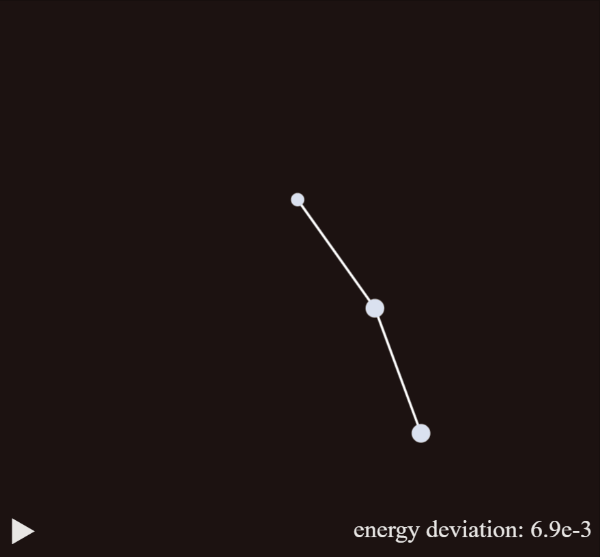

# double pendulum simulation  

https://double-pendulum-sim.netlify.app/



(press `space` to pause/resume the simuation)  

the energy-deviation shows how much the simulation has strayed from the initial energy.  
in a perfect simulation, the energy would be perfectly conserved.  

# about

in this project from September 2020, i implemented a double-pendulum simulation.  
from leonard susskind i've learned how to use the lagrangian to derive the equations of motion.  

here are the relevant pieces of code:  

```
//state = [angle1, angle1Velocity, angle2, angle2Velocity]
function calculateNextPendulumStateByLagrangian(state, gravityForce, dt){
  const [angle1, angleVelocity1, angle2, angleVelocity2] = state;
  const lagrangianAngle1Derivative = gravityForce * (2 * Math.sin(angle1) + Math.sin(angle1 + angle2));
  const lagrangianAngle2Derivative = -(angleVelocity1 + angleVelocity2) * angleVelocity1 * Math.sin(angle2) + gravityForce * Math.sin(angle1 + angle2)
  const p = 1 + Math.cos(angle2);
  const pDot = angleVelocity2 * -Math.sin(angle2);
  const d3 = 1 + 2 * p;
  const d4 = (2 * angleVelocity1 + angleVelocity2) * pDot;
  const d5 = angleVelocity1 * pDot;
  const d1 = lagrangianAngle1Derivative - d4;
  const d2 = lagrangianAngle2Derivative - d5;
  const acc1 = (d2 * p - d1) / (p ** 2 - d3);
  const acc2 = d2 - acc1 * p;

  return [
    angle1 + angleVelocity1 * dt,
    angleVelocity1 + acc1 * dt,
    angle2 + angleVelocity2 * dt,
    angleVelocity2 + acc2 * dt
  ];
}

function calculatePendulumEnergy(state, gravityForce){
  const [angle1, angleVelocity1, angle2, angleVelocity2] = state;
  const kineticEnergy = angleVelocity1 ** 2 + 0.5 * (angleVelocity1 + angleVelocity2) ** 2 + (angleVelocity1 + angleVelocity2) * angleVelocity1 * Math.cos(angle2);
  const potentialEnergy = gravityForce * (2 * Math.cos(angle1) + Math.cos(angle1 + angle2));
return kineticEnergy + potentialEnergy;
}
```